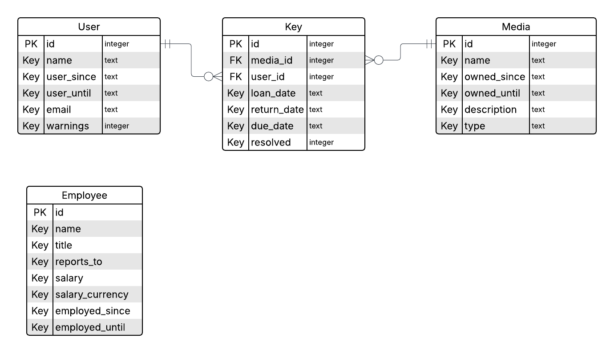

# Database structure
LibbyDB, the database management system, was designed to be generic and useable by practically any library. The database schema is represented here below as an ER diagram (designed with Lucidchart), which illustrates the different tables in the database, and their internal relationships. After that follows an explanation of the variables.



## media
The media table lists various forms of media, such as books, films, etc. It consists of the following variables:

* **id**: The primary key, unique to each piece of media.
* **name**: The name, or title, of the media, for example "There and back again".
* **owned_since**: The date when the media was obtained by the library, in a text string, format "YYYY-MM-DD".
* **owned_until**: The date when the library was considered no longer in posession of the media, for example if sold to another library, or lost by a user.
* **description**: A short textual description of the media.
* **author_id**: The authors id.
* **type**: The media type as a string, one of "book", "film", "cd".
* **loaned**: Boolean indicating whether the media is currently loaned by a user.

## authors
The authors table lists authors whose media are available in the database.

* **id**: The primary key, unique to each author.
* **name**: The text name of the author, for example "Roald Dahl".
* **dob**: Date of birth, in text format "YYYY-MM-DD".
* **dod**: Date of death in text format "YYYY-MM-DD" if applicable, otherwise "null".

## employees
The employees table lists all employees working at the library as well as relevant information.

* **id**: The primary key, unique to each employee. 
* **name**: The name of the employee.
* **title**: The title of the employee, such as "manager", "maintenance", "bounty hunter".
* **reports_to**: The id of the employee that this employee reports to. The "top" employee reports to themselves.
* **salary**: The integer monthly salary of this employee.
* **salary_currency**: The currency of the salary of this employee, one of "SEK", "EUR".
* **employed_since**: The date when this employee began their employment, in text format "YYYY-MM-DD".
* **employed_until**: The date when this employee was terminated, in text format "YYYY-MM-DD" if applicable, otherwise "null".

## users
The users table lists all current and previous users at the library.

* **id**: The primary key, unique to each user. 
* **name**: The name of the user.
* **user_since**: The date when the user account was created.
* **user_until**: The date when the user account was terminated, if applicable.
* **email**: The email address of the user, default "null".
* **warnings**: The interger number of warnings given to the user, default 0. The library may increment as it sees fit, and take this value into account when considering deactivating a user account due to for example overdue media.

## loans
The loans table lists all loans at the library, both currently active and resolved.

* **id**: The primary key, unique to each warrant. 
* **media_id**: The media id.
* **user_id**: The user id.
* **loan_date**: The date when the loan was issued, in a text string, format "YYYY-MM-DD".
* **return_date**: The date when the media was returned, in a text string, format "YYYY-MM-DD", if not returned yet, the default is "null".
* **due_date**: The due date of the media, in a text string, format "YYYY-MM-DD". Usually set to two weeks after the loan_date.
* **employee_id**: The id of the employee that has been assigned to hunt down the media and the user if the media becomes overdue. Otherwise just 'null' by default.
* **resolved**: Boolean indicating whether this loan has been resolved.

# Practical details
Run the following commands to construct the underlying database table structure.
```
CREATE TABLE `media` (
  `id` integer PRIMARY KEY,
  `name` text DEFAULT 'null',
  `owned_since` text DEFAULT 'null',
  `owned_until` text DEFAULT 'null',
  `description` text DEFAULT 'null',
  `author_id` integer DEFAULT 'null',
  `type` text DEFAULT 'null',
  `loaned` boolean DEFAULT 'FALSE'
);

CREATE TABLE `authors` (
  `id` integer PRIMARY KEY,
  `name` text DEFAULT 'null',
  `dob` text DEFAULT 'null',
  `dod` text DEFAULT 'null'
);

CREATE TABLE `employees` (
  `id` integer PRIMARY KEY,
  `name` text DEFAULT 'null',
  `title` text DEFAULT 'null',
  `reports_to` integer 'null',
  `salary` numeric DEFAULT '',
  `salary_currency` text DEFAULT 'SEK',
  `employed_since` text DEFAULT 'null',
  `employed_until` text DEFAULT 'null'
);

CREATE TABLE `users` (
  `id` integer PRIMARY KEY,
  `name` text DEFAULT 'null',
  `user_since` text DEFAULT 'null',
  `user_until` text DEFAULT 'null',
  `email` text DEFAULT 'null',
  `warnings` integer DEFAULT 0
);

CREATE TABLE `loans` (
  `id` integer PRIMARY KEY,
  `media_id` integer DEFAULT 'null',
  `user_id` integer DEFAULT 'null',
  `loan_date` text DEFAULT 'null',
  `return_date` text DEFAULT 'null',
  `due_date` text DEFAULT 'null',
  `employee_id` integer DEFAULT 'null',
  `resolved` boolean DEFAULT 'FALSE'
);
```