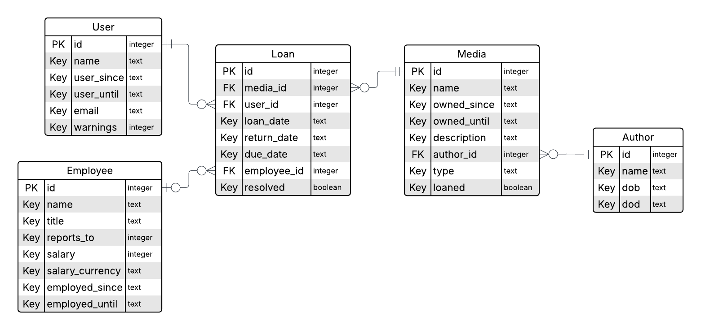

# LibbyDB
LibbyDB is a database management system (DBMS) written in python with a neat user interface implemented using tkinter. This project was born out the authors' desire to practice SQL querying, as well as DBMS and UI design. The setting of a fictional library was selected because it seemed like an interesting challenge to the authors. The database is hosted on Turso.

## Fictional Project Requirements
In order to facilitate development, the following project requirements were formulated at the beginning of the project, as if formulated by the (fictional) client.

* The database must be able to store user information, such as name, contact information and possibly an infraction count, such as 'the number of missed return dates'.

* The database must be able to store media informaton for the collection of the library. Media may be books, films, comics, cd's etc. Each media entry should contain information like name, description, publication date, date when obtained (by the library), date when the media left the collection (if applicable), an indicator of whether the media is currently loaned.

* The databse should hold employee information such as name, salary, title, who the employee reports too, what library location they work at (if applicable).

* In case the library expands across multiple locations, the datbase must be able to store information on which location each media is stored at, as well as where in the library the media is located.

* The DBMS must have friendly UI that employees can use to log new entries in the database. The UI should also be able to query the database for entries, such as overdue media, users etc.

## Project Features
The database currently satisfies most of the features to some extent. Below is an Entity Relationship (ER) diagram that represents the database entities and their relationships.

* LibbyDB is executable, and can be run in the following way, opening either the CLI or GUI. Default mode is "cli". The GUI can also be opened in the CLI.

`python -m libbydb`

`python -m libbydb -mode gui`

* LibbyDB can also be run with the following command:

`YOUR/PATH/HERE/LibbyDB/main.py`